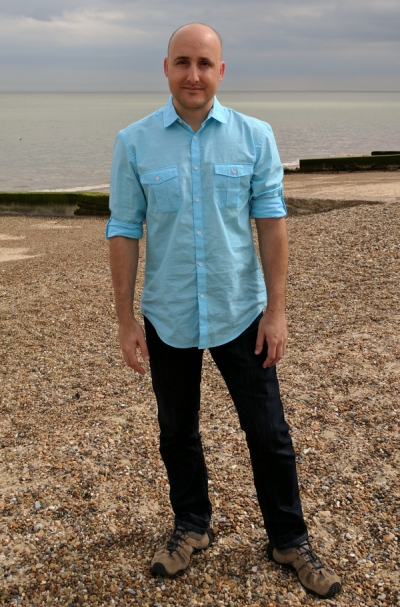

```{r setup, include=FALSE}
knitr::opts_chunk$set(echo = TRUE, message = FALSE)
```

<br><br>

# Matthew Leonawicz

### Statistician | R Developer <a href="http://snap.uaf.edu" target="_blank"></a>



I am the lead statistical analyst for Scenarios Network for Alaska & Arctic Planning at the University of Alaska Fairbanks.
I love programming in R. Much of my work revolves around high performance statistical computing, web application development, data visualization, and dynamic reporting.
I develop R Shiny apps for presentation of statistical analyses and scientific information suitable for a range of audiences and I always enjoy opportunities to create informative, beautiful graphics.

I help develop and promote scientific and analytic coding best practices for SNAP. I develop and deploy new analytic and visualization tools. My tech blog helps promote SNAP technical capacity. I enjoy networking with other R developers, statisticians, data analysts, researchers, and useRs around the globe.
While I don't have a lot of time to blog, I post more frequent updates on [Twitter](https://twitter.com/leonawicz). A lot of my R code is open source and freely available here on [Github](https://github.com/leonawicz).

When not neck deep in R code, I can generally be found supervising others in analytic and data processing positions as well as providing guidance, education and training to co-workers on topics of statistics, modeling, analysis, data visualization, data processing, and statistical programming.

```{r showcase, echo = FALSE}
library(shiny)
library(apputils)
labels <- lapply(c("Shiny", "Visualizations", "R packages", "The SNAPverse", "Blog"), h4)
app_urls <- c(paste0(c("apps", "vis", "pkgs", "sv"), ".html"), "blog")
img_urls <- paste0("assets/img/", c("apps.jpg", "datavis_r_geonet3.jpg", "Rlogo.svg", "snap_symbol.svg", "blog.jpg"))
titles <- c("R Shiny Apps", "Data visualizations", 
            "Selected R packages", "SNAPverse R packages", "If Time, Then Blog")
subs <- c("Explore the collection", "Static graphics and animations", 
          "GitHub fast. CRAN strong.", "Traverse the verse...", "My R and Shiny posts")
padding <- paste0("padding:", c(rep("0px", 3), "10px", "10px", "0px"), ";")
app_showcase(app_urls, img_urls, titles, subs, labels, img_style = padding, new_window = FALSE)
knitr::opts_chunk$set(echo = TRUE)
```
